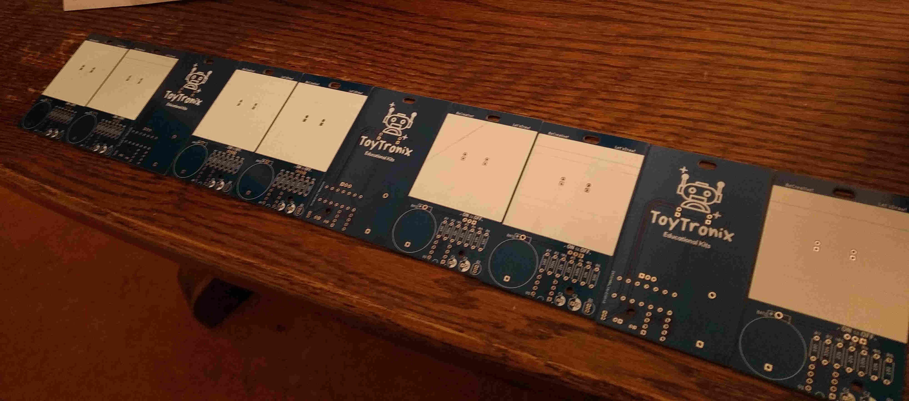

# ToyTronix Student Company - Soldering Kit

ToyTronix - a soldering kit for young children. The idea was inspired by [Shawn Hymmel's 555 timer badge](https://twitter.com/oshpark/status/1000262755927064576). I worked through the whole process of design to production.

